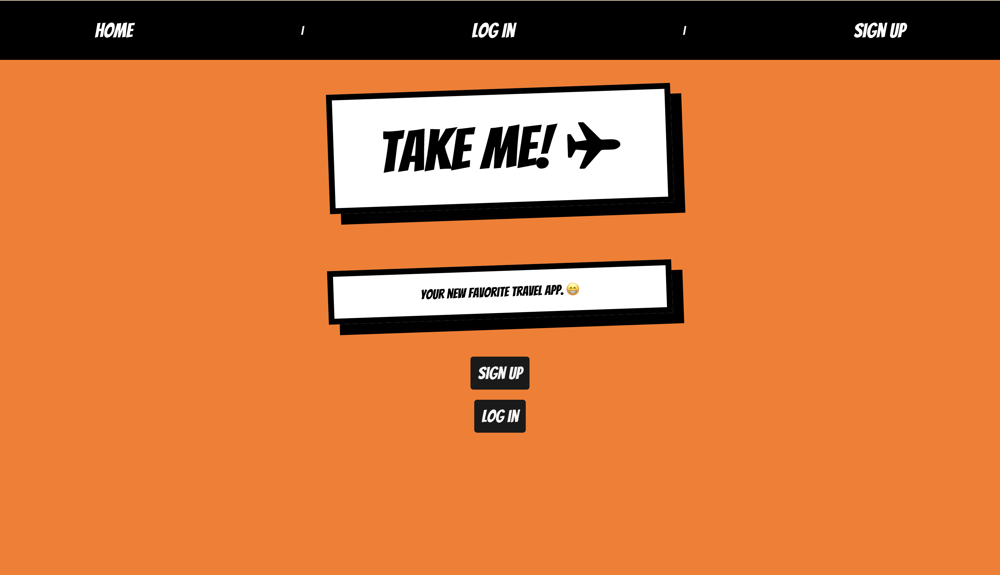

# Take Me With You?
Welcome to my second app as a software developer. I love travelling and will be moving back to Spain in a month. I wanted to create an app that coulr easily log my travels and my friends travels. The goal is to see what everyone in my community has been up to and what their travels looked like.

I developed this app using **HTML, CSS**, **Javascript**, **Node JS**, **Express**, **mongoose** and **React**.

## Technologies Used
* CSS
* Javascript
* HTML
* Express
* Node JS
* Nodemon
* MongoDB
* bcrypt
* react
* mongoose

## Middleware Used
* express-session
* method-overide
* morgan
* bcrypt

## Project Planning
* I used **Lucid** to design my ERD.
* I used **Trello** to document my ERD and User Stories. [here]
(https://trello.com/invite/b/66e44a90743889d416206ef7/ATTI6a983a811593a27f467066b0592d428dCB5692F5/take-me-with-you) 

> **Shoutout** to Sam for helping me tremedously as I struggled with where to start and to Jim for dealing with all my questions and issues.

## How to Use
> When you open the app, start by signing up with a username and password. 
> When you log in the first page you will see is a display of all the user's and their countries in the database! 
> You can then navigate to Your countries where you will find the specific countries you have travelled to. If you have no countries, you can add them here. 
> In each country you have travelled to, you will be able to click in them and see a list of cities you have been to in that country. You can also add a city or delete the entire country. 
> From there, when you click a city that you have previously logged, you can update the city details and information.

One exciting feature I love about the app is the ability to see other traveller's countries, cities and city details! Being able to see what other travllers liked or disliked about a particular city saves alot of time when looking for recommendations. 

## Future Updates
* Adding a way to use googlemaps api to see the locations on a map. In the same way Apple logs your photos in different location across the world and you can see it on the app as a map.
* Make a more interesting UI.
* Figure out how to make it a social media app. 
* Figure out how to create a list when rendering multiple typed entries in "Historical Sites, Food, Entertainment" Would I need a subdocument again or can I do it in the front end? 

## Live Demo
You can use my first ever app creation **Take Me With You** [here](
https://take-me-with-you-2ffc640dfa66.herokuapp.com/)

### Screenshot
